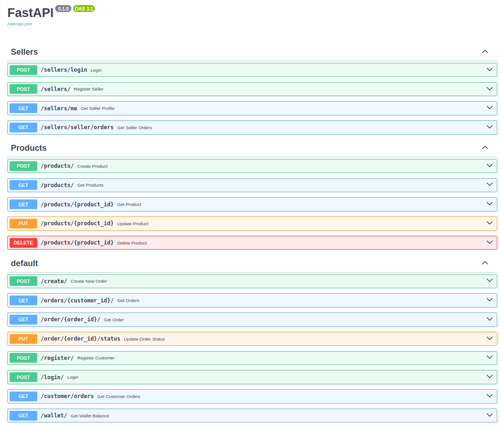

# E-commerce-FastAPI Backend Project

A robust and scalable backend built with FastAPI showcases essential features for managing sellers, customers, products, and orders. This project demonstrates the use of JWT authentication, and ORM for database interactions, data validation, and interactive API documentation.

# 🚀 Features
- 🔒 **Authentication & Authorization**
JWT Tokens for secure user login and session management.
Separate authentication flows for Sellers and Customers.
- 📦 **Product Management**
CRUD operations for products: Create, Read, Update, and Delete.
Validation for product data to ensure consistency.
- 🛒 **Order Management**
APIs for creating and managing customer orders.
Endpoints for updating order statuses.
- 👥 **User Management**
Seller and customer registration.
Access seller profiles and customer order history.
- 💰 **Wallet Management**
Retrieve customer wallet balances for seamless payment integration.

# 🛠️ Tech Stack
- **FastAPI:** For building high-performance REST APIs.
- **Python:** Core programming language.
- **SQLAlchemy/ORM:** For database modeling and operations.
- **SQLite/PostgreSQL:** Database for storing application data.
- **JWT (JSON Web Tokens):** For authentication and authorization.
- **Pydantic:** For data validation and type hinting.
- **Swagger UI:** Auto-generated, interactive API documentation.

# 📂 Project Structure
```bash
├── app/
│   ├── main.py             # Application entry point
│   ├── models/             # Database models
│   ├── routes/             # API routes for various features
│   ├── schemas/            # Pydantic schemas for validation
│   ├── services/           # Business logic and utility functions
│   └── config.py           # Configuration (e.g., database settings, JWT secrets)
├── requirements.txt        # Python dependencies
├── README.md               # Project documentation
└── .env                    # Environment variables
```

# ⚡ Getting Started
1️⃣ Clone the repository
- ```git clone```

2️⃣ Create a virtual environment

3️⃣ Install dependencies
- ```pip install -r requirement.txt```

4️⃣ Set up environment variables
```
DATABASE_URL=sqlite:///./test.db  # Example for SQLite
JWT_SECRET_KEY=your_secret_key
JWT_ALGORITHM=HS256
ACCESS_TOKEN_EXPIRE_MINUTES=30
```

5️⃣ Run the application
- ```uvicorn app.main:app```

6️⃣ Access API documentation
- [ Swagger UI ](http://127.0.0.1:8000/docs)

**Sample FASTAPI interactive documentation**


# 🤝 Contributing
Contributions are welcome! If you’d like to enhance the project or fix issues, feel free to fork the repository and submit a pull request.

# 📄 License
This project is licensed under the MIT License.

# 📧 Contact
Feel free to reach out if you have any questions or suggestions!

- Email: vivekmahale9853@gmail.com
- LinkedIn: https://www.linkedin.com/in/vivek-mahale-493758169/
